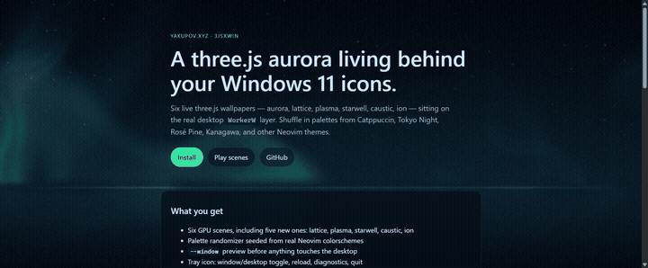

# 3JSxWin

<p align="center">
  
</p>

<p align="center">
  <a href="https://yakupov.xyz/"></a>
  <a href="https://yakupov.xyz/install"></a>
  <a href="https://yakupov.xyz/"></a>
  <a href="https://github.com/yaluft/3JSxWin/actions/workflows/ci.yml"></a>
</p>

<p align="center">
  <code>threejs</code> · <code>windows-11</code> · <code>wallpaper</code> · <code>webview2</code> · <code>wpf</code> · <code>glsl</code> · <code>neovim</code>
</p>

A live [three.js](https://threejs.org) scene as a Windows 11 wallpaper. It sits on the real desktop `WorkerW` layer — behind your icons, behind the taskbar — hosted in WebView2 from a small WPF app.

**Site:** [yakupov.xyz](https://yakupov.xyz/) · **Scenes:** [yakupov.xyz/scene](https://yakupov.xyz/scene/) · **Install:** [yakupov.xyz/install](https://yakupov.xyz/install)

`]` cycles scenes · `P` shuffles a Neovim palette · the name of the scene and palette flashes on each switch

## Why

Most live wallpapers sit *on top* of the desktop or replace Explorer. This one attaches to the same hidden Worker window Explorer uses for wallpaper, so icons stay clickable and the taskbar stays on top.

The renderer is a vendored three.js scene (r185, offline). Tune it live with `Ctrl+Alt+B`.

## Features

- Nine core scenes always loaded: Aurora, Tube Dunes, Starwell, Tube Warp, Ion, Tube Loops, Ember, Kelp, Murmur
- Optional library under `web/themes/` (Mycelight, Mothwork, Coralnet, Lungclock, Inkatrium, Foldwell, Sporehall, Orreryheart, Threadloom, **Deep Field**) — files ship, shaders load only after you install them in the console. Preview v2: Deep Field (nebula, debris, meteor storms).
- Generated soundscapes (no files); optional themes bring their own graph
- ASCII scenes use a 32-glyph density ramp, palette-tinted ink, and a 480-column cap
- Palette randomizer using real Neovim themes (Catppuccin, Tokyo Night, Rosé Pine, Kanagawa, …)
- Dual-monitor default: one native-resolution copy per display (`--duplicate-all`)
- `--window` preview before anything touches the desktop
- Tray icon: window/desktop toggle, layout, reload, diagnostics, quit
- On-scene console (`Ctrl+Alt+B`) with live sliders and colour pickers
- Startup shortcut — no admin, no registry
- Adaptive quality ladder so it can sit in the background for hours

## Quick start

**Install from the site** (Windows 11, or 10 20H1+):

```powershell
irm https://yakupov.xyz/install.ps1 | iex
```

That downloads the zip, puts it in `%LOCALAPPDATA%\3JSxWin`, adds a Startup shortcut, and opens a preview window. Full notes: [yakupov.xyz/install](https://yakupov.xyz/install).

To build from source you need [WebView2](https://developer.microsoft.com/microsoft-edge/webview2/) (already on Win11) and the [.NET 8 SDK](https://dotnet.microsoft.com/download/dotnet/8.0) (x64):

```powershell
git clone https://github.com/yaluft/3JSxWin.git
cd 3JSxWin
.\build.ps1
.\dist\Backdrop.exe --window    # always test here first
.\dist\Backdrop.exe             # then put it on the desktop
```

First build pulls the WebView2 NuGet package. You should end at `dist\Backdrop.exe`. If PowerShell blocks the script:

```powershell
powershell -ExecutionPolicy Bypass -File .\build.ps1
```

Keep the tree off OneDrive and out of paths with spaces.

## Using it

The window disappears in desktop mode. A tray icon is the way back:

| Action | What it does |
| --- | --- |
| Show in a window | Pull the scene off the desktop |
| Desktop layout | Single, span all, or duplicate on every monitor |
| Reload scene | Re-read `dist\web\config.json` |
| Open scene folder | Jump to `dist\web\` |
| Open DevTools | Needs `--devtools` on the command line |
| Open log | `%LOCALAPPDATA%\Backdrop\backdrop.log` |
| Quit Backdrop | Exit |

Double-click the tray icon to toggle window and desktop mode.

With two or more monitors the default is **duplicate** (one scene per display at native resolution). The tray pick is remembered.

```powershell
.\dist\Backdrop.exe --duplicate-all   # one copy per monitor (default on dual screen)
.\dist\Backdrop.exe --span-all        # one canvas across every monitor
.\dist\Backdrop.exe --monitor 1       # second monitor from the left only
.\install-startup.ps1
.\install-startup.ps1 -Arguments "--span-all"
.\install-startup.ps1 -Remove
```

Win+`]` next scene · Win+`[` previous · Win+`P` shuffle palette. Each switch shows the scene name and palette for a couple of seconds.

### Tune the scene

`Ctrl+Alt+B` opens a floating console. Changes preview live. **SAVE** writes `config.json`; closing without saving discards them. Controls marked `*` (mote count, clock) need a reload, which SAVE does once.

Hand-edit `dist\web\config.json` and **Reload scene**, or edit `src\Backdrop\web\config.json` so it survives the next build:

```jsonc
"aurora":  { "intensity": 0.95, "speed": 0.055, "height": 0.5 },
"horizon": { "y": 0.36, "glow": 0.85, "reflection": 0.32 }
```

Raise `horizon.y` toward `0.5` for more sky, or `intensity` toward `1.4` to make it louder.

The aurora is a full-screen shader quad; the motes are a GPU points field. Both follow official three.js examples — see [CREDITS.md](CREDITS.md).

## If it goes wrong

| Symptom | What to do |
| --- | --- |
| Nothing happens | Read `%LOCALAPPDATA%\Backdrop\backdrop.log` |
| "Already running" | It is in the notification overflow |
| Running, but blank | Look for `Attached to WorkerW`. If not, `.\dist\Backdrop.exe --diagnose` |
| Only one monitor | Tray → Desktop layout → Duplicate on all monitors |
| Covers icons | Another wallpaper tool owns the layer — close Wallpaper Engine / Lively / Rainmeter |
| Black after unplug / DPI change | It re-attaches in ~4s; otherwise **Reload scene** |
| Old wallpaper after reboot | Expected until you run `.\install-startup.ps1` |
| High GPU | `--fps 20 --scale 0.6`, or set those in `config.json` |
| `dotnet` missing / NU1101 | SDK not on PATH, or nuget.org unreachable |
| Flat colour, no aurora | Software WebGL fallback — `--devtools` and paste the shader error |

Desktop mode no longer falls back to a window. It retries silently. `Chosen layer : None` means Explorer is not running normally.

Full walkthrough: [INSTALL.md](INSTALL.md). Config reference: [docs/pages/configure.md](docs/pages/configure.md). Microsoft Store: [docs/publish-ms-store.md](docs/publish-ms-store.md).

## Site

The landing page, installer, and a live browser preview of the scene are served from a Cloudflare Worker at [yakupov.xyz](https://yakupov.xyz/).

| Path | Page |
| --- | --- |
| [yakupov.xyz](https://yakupov.xyz/) | Landing page |
| [yakupov.xyz/scene](https://yakupov.xyz/scene/) | Live scene preview |
| [yakupov.xyz/install](https://yakupov.xyz/install) | Install notes |

From `site/`:

```powershell
npm install
npx wrangler deploy
```

## Contributing

Small enough to read in an afternoon; wide enough to touch Win32, WPF, WebView2, and GLSL. See [CONTRIBUTING.md](CONTRIBUTING.md). New scene recipe: [docs/add-a-scene.md](docs/add-a-scene.md).

Helpful areas: multi-monitor layout, WorkerW attach reliability, low-end GPU budgets, presets, shader polish.

## Credits

[three.js](https://github.com/mrdoob/three.js) · [Microsoft WebView2](https://learn.microsoft.com/microsoft-edge/webview2/) · [Claude](https://claude.ai/) during design and debugging

Full list: [CREDITS.md](CREDITS.md)
