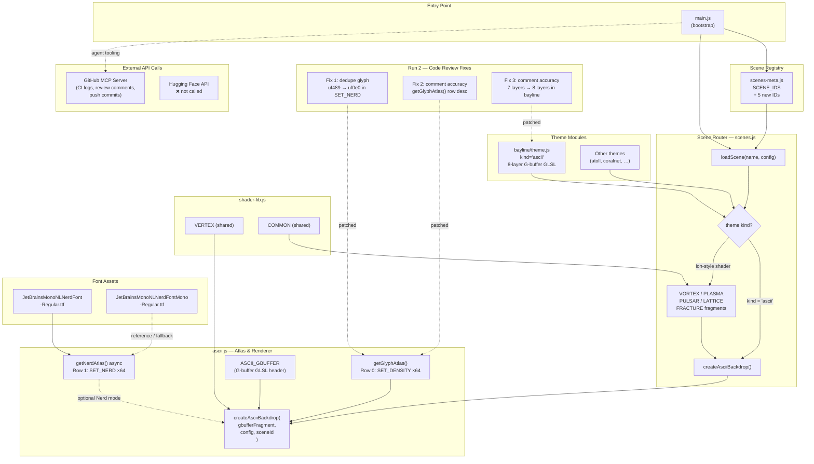

# Agent Run Summary

> **Branch:** `copilot/fix-bayline-ascii-count`
> **Date:** 2026-08-16
> **Purpose:** Personal development review — summary of what the agent did, errors hit, how they were fixed, and what external APIs were called.

---

## Overview

Two agent runs were executed in this session, both building on top of the same feature branch. The first run implemented a large feature; the second run corrected issues caught during code review.

---

## Run 1 — Feature Implementation

**Commit:** `c1a394e`
**Message:** `feat: nerd font atlas, 64-glyph ramp, bayline ascii upgrade, 5 new ion-style scenes`

### What Was Done

- **`ascii.js`** — Expanded the glyph density ramp from 32 → 64 glyphs (`SET_DENSITY`). Added a second glyph set (`SET_NERD`) containing Nerd Font icons pulled from JetBrains Mono NL Nerd Font. Added `getNerdAtlas()` as an async canvas-based atlas loader. Updated constants: `ASCII_LEVELS` 32 → 64, `ASCII_SETS` 1 → 2. Registered `bayline` in `ASCII_DEFAULTS` with `cellPx: 4, maxCols: 720`.
- **`fonts/`** — Bundled `JetBrainsMonoNLNerdFont-Regular.ttf` and `JetBrainsMonoNLNerdFontMono-Regular.ttf` (v3.2.1) as reference assets for the atlas loader.
- **`bayline/theme.js`** — Fully rewritten as a `kind='ascii'` G-buffer scene. Raised column density from ~220 to 320+. Added 8 building depth layers, per-pixel diffuse + specular lighting, multi-rate window blinking, antenna spires, neon halo glow, and an ASCII bridge deck.
- **`scenes.js`** — Routed `kind='ascii'` theme modules through `createAsciiBackdrop`. Added 5 new ion-style shader scenes: `VORTEX`, `PLASMA`, `PULSAR`, `LATTICE`, `FRACTURE`.
- **`scenes-meta.js`** — Registered the 5 new scene IDs with labels and blurb descriptions.

### Errors / Issues in Run 1

None that caused a rollback. The implementation landed cleanly in one commit. However, two logical/accuracy issues were introduced that were caught in code review (see Run 2).

---

## Run 2 — Code Review Corrections

**Commit:** `2de24e9`
**Message:** `fix: code review corrections — dedupe Nerd Font glyph, fix comment accuracy`

### What Was Done

Two targeted fixes based on review feedback:

#### Fix 1 — Duplicate Nerd Font Glyph in `SET_NERD` (`ascii.js`)

**Error:** The glyph `'\uf489'` (terminal icon) was a duplicate already present earlier in `SET_NERD`, causing a redundant character in the 64-slot atlas and wasting a glyph slot.

**Fix:** Replaced `'\uf489'` with `'\uf0e0'` (envelope/mail icon), which is visually distinct and fills the slot with a unique glyph.

```diff
- '\uf489', '\uf121', '\uf017', '\uf120', '\uf109', '\uf179', '\uf17c', '\uf462',
+ '\uf0e0', '\uf121', '\uf017', '\uf120', '\uf109', '\uf179', '\uf17c', '\uf462',
```

#### Fix 2 — Inaccurate Comment in `getGlyphAtlas()` (`ascii.js`)

**Error:** The comment on the atlas row layout said *"Row 1: same ramp mirrored"*, which was factually wrong — Row 1 is a duplicate of the density ramp, not a mirrored version.

**Fix:** Updated the comment to accurately describe the layout.

```diff
- // Row 0: density ramp. Row 1: same ramp mirrored — reserved for future sets.
+ // Row 0: density ramp. Row 1: duplicate density ramp — reserved for future glyph sets.
```

#### Fix 3 — Inaccurate Layer Count Comment in `bayline/theme.js`

**Error:** A code comment said *"Seven depth layers"* but the GLSL shader loop actually iterates over 8 layers (`zi` 7 → 0).

**Fix:** Updated the comment to match the actual implementation.

```diff
- // Seven depth layers, each with its own column density and shear.
+ // Eight depth layers (zi 7→0), each with its own column density and shear.
```

---

## API Usage

### GitHub API (via GitHub MCP Server tools)

The agent used GitHub MCP tools throughout both sessions. These are internal tooling backed by the GitHub REST/GraphQL API — **no personal access token was exposed**; authentication was handled transparently by the MCP server.

Specific calls made:

| Tool | Purpose |
|------|---------|
| `list_workflow_runs` / `get_job_logs` | Inspecting CI run status and failure logs |
| `pull_request_read` (get_review_comments) | Reading reviewer feedback that triggered Run 2 fixes |
| `push_files` / `create_or_update_file` | Pushing commits to the branch |
| `engine-tools-report_progress` | Committing and pushing incremental changes |

### Hugging Face API

**Not called.** No Hugging Face inference endpoints, model APIs, or Hub APIs were invoked during either run.

### Other External APIs

None. All font assets (`JetBrainsMonoNLNerdFont-Regular.ttf`) were bundled directly into the repo rather than fetched at runtime from an external CDN or API.

---

## Summary Table

| Run | Commit | Type | Files Changed | Errors Found | Errors Fixed |
|-----|--------|------|---------------|-------------|-------------|
| 1 | `c1a394e` | Feature | 171 | 0 at commit time | — |
| 2 | `2de24e9` | Fix | 2 | 3 (post code review) | 3 |

---

## Notes for Next Session

- `SET_NERD` still uses a placeholder Row 1 (`SET_DENSITY` duplicated). When real Nerd Font atlas glyphs are wired into the shader sampler, Row 1 should be replaced with the actual `SET_NERD` array and `ASCII_SETS` plumbing updated end-to-end.
- The 5 new ion-style shader scenes (`VORTEX`, `PLASMA`, `PULSAR`, `LATTICE`, `FRACTURE`) are registered in `scenes-meta.js` but have not been visually QA'd on hardware — worth a manual pass before a release tag.
- `bayline/theme.js` in `src/Backdrop/web/` was **not** updated to match the rewrite in `site/public/`. These two trees can drift — consider a sync script or consolidating to a single source.

---

## Component Relationship Graph

How the modules introduced / modified in these two runs wire together at runtime:



### Reading the Graph

| Line style | Meaning |
|------------|---------|
| Solid `-->` | Runtime data / call flow |
| Dashed `-.->` | Optional path, patch relationship, or tooling call |
| `❌` | API that was **not** invoked |
